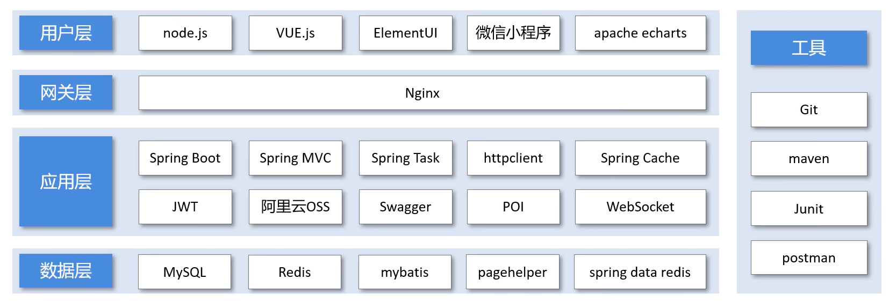
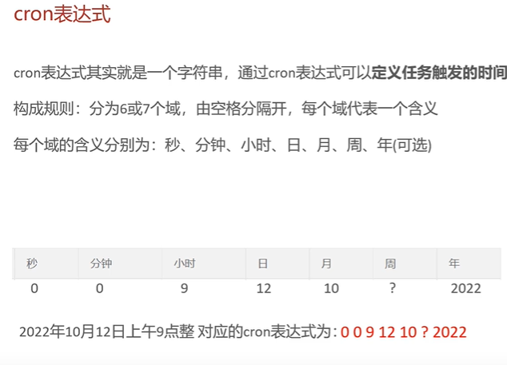
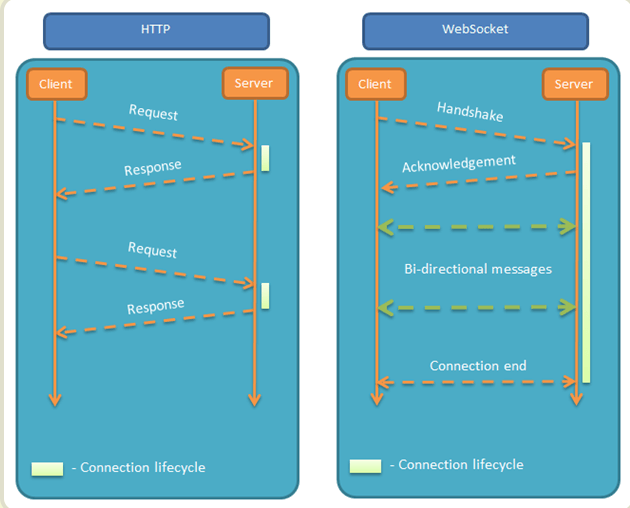

# 苍穹外卖后端项目

## 1. 介绍

​	黑马程序员Java项目实战《苍穹外卖》，视频学习网址：https://www.bilibili.com/video/BV1TP411v7v6/


## 2. 快速开始

下载《苍穹外卖》项目资料。参考博客分享资料：https://blog.csdn.net/AI21341314/article/details/134229446


## 3. 技术学习 




---

### 微信小程序

微信小程序官方开发文档：https://developers.weixin.qq.com/miniprogram/dev/devtools/ext.html

微信开发者工具下载地址：https://developers.weixin.qq.com/miniprogram/dev/devtools/download.html


### 前端nginx配置


### Swagger

使用方式：

1. 导入knife4j的Maven坐标
2. 在配置类中加入knife4j相关配置
3. 设置静态资源映射，否者接口文档页面无法访问


导入Maven：

```xml
        <dependency>
            <groupId>com.github.xiaoymin</groupId>
            <artifactId>knife4j-spring-boot-starter</artifactId>
            <version>3.0.2</version>
        </dependency>
```


配置类：

```java
import com.sky.interceptor.JwtTokenAdminInterceptor;
import com.sky.json.JacksonObjectMapper;
import lombok.extern.slf4j.Slf4j;
import org.springframework.beans.factory.annotation.Autowired;
import org.springframework.context.annotation.Bean;
import org.springframework.context.annotation.Configuration;
import org.springframework.http.converter.HttpMessageConverter;
import org.springframework.http.converter.json.MappingJackson2HttpMessageConverter;
import org.springframework.web.servlet.config.annotation.InterceptorRegistry;
import org.springframework.web.servlet.config.annotation.ResourceHandlerRegistry;
import org.springframework.web.servlet.config.annotation.WebMvcConfigurationSupport;
import springfox.documentation.builders.ApiInfoBuilder;
import springfox.documentation.builders.PathSelectors;
import springfox.documentation.builders.RequestHandlerSelectors;
import springfox.documentation.service.ApiInfo;
import springfox.documentation.spi.DocumentationType;
import springfox.documentation.spring.web.plugins.Docket;

import java.util.List;

/**
 * 配置类，注册web层相关组件
 */
@Configuration
@Slf4j
public class WebMvcConfiguration extends WebMvcConfigurationSupport {

    @Autowired
    private JwtTokenAdminInterceptor jwtTokenAdminInterceptor;

    /**
     * 注册自定义拦截器
     *
     * @param registry
     */
    protected void addInterceptors(InterceptorRegistry registry) {
        log.info("开始注册自定义拦截器...");
        registry.addInterceptor(jwtTokenAdminInterceptor)
                .addPathPatterns("/admin/**")
                .excludePathPatterns("/admin/employee/login");
    }

    /**
     * 通过knife4j生成接口文档
     * @return
     */
    @Bean
    public Docket docket1() {
        ApiInfo apiInfo = new ApiInfoBuilder()
                .title("苍穹外卖项目接口文档")
                .version("2.0")
                .description("苍穹外卖项目接口文档")
                .build();
        Docket docket = new Docket(DocumentationType.SWAGGER_2)
                .groupName("管理端接口")
                .apiInfo(apiInfo)
                .select()
                .apis(RequestHandlerSelectors.basePackage("com.sky.controller.admin"))
                .paths(PathSelectors.any())
                .build();
        return docket;
    }

    @Bean
    public Docket docket2() {
        ApiInfo apiInfo = new ApiInfoBuilder()
                .title("苍穹外卖项目接口文档")
                .version("2.0")
                .description("苍穹外卖项目接口文档")
                .build();
        Docket docket = new Docket(DocumentationType.SWAGGER_2)
                .groupName("用户端接口")
                .apiInfo(apiInfo)
                .select()
                .apis(RequestHandlerSelectors.basePackage("com.sky.controller.user"))
                .paths(PathSelectors.any())
                .build();
        return docket;
    }

    /**
     * 设置静态资源映射
     * @param registry
     */
    protected void addResourceHandlers(ResourceHandlerRegistry registry) {
        registry.addResourceHandler("/doc.html").addResourceLocations("classpath:/META-INF/resources/");
        registry.addResourceHandler("/webjars/**").addResourceLocations("classpath:/META-INF/resources/webjars/");
    }

    /**
     * 扩展消息转换器
     * @param converters
     */
    protected void extendMessageConverters(List<HttpMessageConverter<?>> converters) {
        log.info("扩展消息转换器...");
        //创建消息转换器对象
        MappingJackson2HttpMessageConverter messageConverter = new MappingJackson2HttpMessageConverter();
        //设置对象转换器，底层使用Jackson将Java对象转为json
        messageConverter.setObjectMapper(new JacksonObjectMapper());
        //将上面的消息转换器对象追加到mvc框架的转换器集合中
        converters.add(0,messageConverter);
    }

}
```


swagger3 配置

https://www.cnblogs.com/antLaddie/p/17418078.html#_label0_2

https://www.bilibili.com/video/BV1TP411v7v6/?p=14&spm_id_from=333.1007.top_right_bar_window_history.content.click&vd_source=e983099f78ba163b840f482e15f78f9f


swagger2 配置

https://blog.csdn.net/jialuosi/article/details/132871295


Swagger 注解的实施通常包括以下步骤：

> @Api：这个总括性的注解用来封装 API 级别的信息，如名字、描述和标签。
>
> @ApiOperation：详细说明各个 API 操作，包括操作摘要、描述和所使用的HTTP方法。
>
> @ApiParam：详尽阐述请求参数的细节，包括参数的名称、描述、数据类型和默认值。
>
> @ApiResponse：描述 API 操作可能的结果或响应，指定 HTTP 状态码和消息详情。
>
> @ApiModel：与数据结构或模型有关，提供模型定义、描述和属性的深刻洞见。
>
> @ApiModelProperty：集中描述单一模型属性，列出名称、类型和描述等特性。
>
> @ApiIgnore：从生成的文档中排除特定 API 或操作的注解。


### 阿里云oss对象储存

博客参考：https://blog.csdn.net/AN_NI_112/article/details/132076550


### Spring Task

​	可以按照约定的时间自动执行某个代码逻辑


1.  cron表达式




### WebSocket

博客参考：https://www.ruanyifeng.com/blog/2017/05/websocket.html

WebSocket 协议在2008年诞生，2011年成为国际标准。所有浏览器都已经支持了。它的最大特点就是，服务器可以主动向客户端推送信息，客户端也可以主动




其他特点包括：

（1）建立在 TCP 协议之上，服务器端的实现比较容易。

（2）与 HTTP 协议有着良好的兼容性。默认端口也是80和443，并且握手阶段采用 HTTP 协议，因此握手时不容易屏蔽，能通过各种 HTTP 代理服务器。

（3）数据格式比较轻量，性能开销小，通信高效。

（4）可以发送文本，也可以发送二进制数据。

（5）没有同源限制，客户端可以与任意服务器通信。

（6）协议标识符是`ws`（如果加密，则为`wss`），服务器网址就是 URL。


### Spring Cache数据缓存

参考博客：https://www.cnblogs.com/yoci/p/11595226.html

使用：

- 导入依赖

  ```xml
  <dependency>
  	<groupId>org.springframework.boot</groupId>
  	<artifactId>spring-boot-starter-cache</artifactId>
  </dependency>
  ```

- 在启动类上添加注解开启缓存；

  ```java
  @SpringBootApplication
  @EnableTransactionManagement //开启注解方式的事务管理
  @EnableCaching  // 开启缓存
  public class SkyApplication {
      public static void main(String[] args) {
          SpringApplication.run(SkyApplication.class, args);
          log.info("server started");
      }
  }
  ```

- 在方法上添加注解

| 名称           | 解释                                                         |
| :------------- | :----------------------------------------------------------- |
| Cache          | 缓存接口，定义缓存操作。实现有：RedisCache、EhCacheCache、ConcurrentMapCache等 |
| CacheManager   | 缓存管理器，管理各种缓存（cache）组件                        |
| @Cacheable     | 主要针对方法配置，能够根据方法的请求参数对其进行缓存         |
| @CacheEvict    | 清空缓存                                                     |
| @CachePut      | 保证方法被调用，又希望结果被缓存。 与@Cacheable区别在于是否每次都调用方法，常用于更新 |
| @EnableCaching | 开启基于注解的缓存                                           |
| keyGenerator   | 缓存数据时key生成策略                                        |
| serialize      | 缓存数据时value序列化策略                                    |
| @CacheConfig   | 统一配置本类的缓存注解的属性                                 |


项目中所使用的：

admin/SetmealController.java

```java
/**
     * 套餐起售、停售
     *
     * @param status
     * @param id
     * @return
     */
@PostMapping("/status/{status}")
@ApiOperation("套餐起售、停售")
@CacheEvict(cacheNames = "setmealCache",allEntries = true)
public Result startOrStop(@PathVariable Integer status, Long id) {
    setmealService.startOrStop(status, id);
    return Result.success();
}
```

user/SetmealController.java

```java
/**
 * 套餐起售、停售
 *
 * @param status
 * @param id
 * @return
 */
@PostMapping("/status/{status}")
@ApiOperation("套餐起售、停售")
@CacheEvict(cacheNames = "setmealCache",allEntries = true)
public Result startOrStop(@PathVariable Integer status, Long id) {
    setmealService.startOrStop(status, id);
    return Result.success();
}
```


### POI 操作excel文件

参考博客：https://blog.csdn.net/hadues/article/details/113859228

Apache POl是一个处理Miscrosoft Office各种文件格式的开源项目。简单来说就是，我们可以使用 POI在 Java 程序中对Miscrosoft Office各种文件进行读写操作。

ReportServiceImpl.java

```java
    /**
     * 导出运营数据报表
     * @param response
     */
    public void exportBusinessData(HttpServletResponse response) {
        //1. 查询数据库，获取营业数据---查询最近30天的运营数据
        LocalDate dateBegin = LocalDate.now().minusDays(30);
        LocalDate dateEnd = LocalDate.now().minusDays(1);

        //查询概览数据
        BusinessDataVO businessDataVO = workspaceService.getBusinessData(LocalDateTime.of(dateBegin, LocalTime.MIN), LocalDateTime.of(dateEnd, LocalTime.MAX));

        //2. 通过POI将数据写入到Excel文件中
        InputStream in = this.getClass().getClassLoader().getResourceAsStream("template/运营数据报表模板.xlsx");

        try {
            //基于模板文件创建一个新的Excel文件
            XSSFWorkbook excel = new XSSFWorkbook(in);

            //获取表格文件的Sheet页
            XSSFSheet sheet = excel.getSheet("Sheet1");

            //填充数据--时间
            sheet.getRow(1).getCell(1).setCellValue("时间：" + dateBegin + "至" + dateEnd);

            //获得第4行
            XSSFRow row = sheet.getRow(3);
            row.getCell(2).setCellValue(businessDataVO.getTurnover());
            row.getCell(4).setCellValue(businessDataVO.getOrderCompletionRate());
            row.getCell(6).setCellValue(businessDataVO.getNewUsers());

            //获得第5行
            row = sheet.getRow(4);
            row.getCell(2).setCellValue(businessDataVO.getValidOrderCount());
            row.getCell(4).setCellValue(businessDataVO.getUnitPrice());

            //填充明细数据
            for (int i = 0; i < 30; i++) {
                LocalDate date = dateBegin.plusDays(i);
                //查询某一天的营业数据
                BusinessDataVO businessData = workspaceService.getBusinessData(LocalDateTime.of(date, LocalTime.MIN), LocalDateTime.of(date, LocalTime.MAX));

                //获得某一行
                row = sheet.getRow(7 + i);
                row.getCell(1).setCellValue(date.toString());
                row.getCell(2).setCellValue(businessData.getTurnover());
                row.getCell(3).setCellValue(businessData.getValidOrderCount());
                row.getCell(4).setCellValue(businessData.getOrderCompletionRate());
                row.getCell(5).setCellValue(businessData.getUnitPrice());
                row.getCell(6).setCellValue(businessData.getNewUsers());
            }

            //3. 通过输出流将Excel文件下载到客户端浏览器
            ServletOutputStream out = response.getOutputStream();
            excel.write(out);

            //关闭资源
            out.close();
            excel.close();
        } catch (IOException e) {
            e.printStackTrace();
        }

    }
    
```


# 注释

路漫漫其修远兮，吾将上下而求索。


